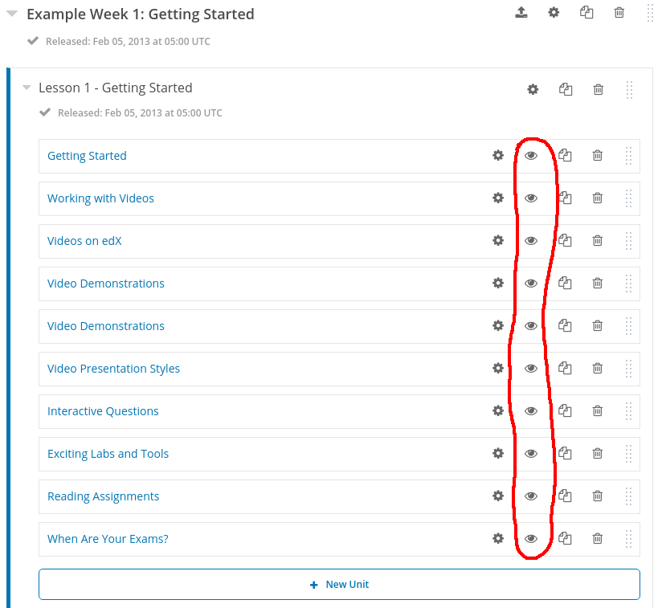
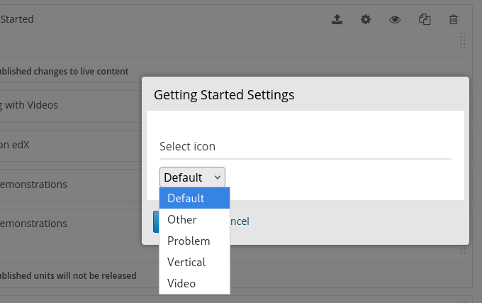

# Icon Editor Theme

This theme adds a unit editor to the Studio in Open edX.

## Installation

1. Install [custom-unit-icons](https://github.com/open-craft/custom-unit-icons).
1. [Set up](https://edx.readthedocs.io/projects/edx-installing-configuring-and-running/en/open-release-koa.master/ecommerce/theming.html) this comprehensive theme.
1. Visit the Course Outline page in Studio to find the new editor.

## Screenshots

### Buttons

### Editor

## License

The code in this repository is licensed under the AGPL 3.0 unless
otherwise noted.

Please see `LICENSE.txt` for details.

## How To Contribute

Contributions are very welcome.

Please read [How To Contribute](https://github.com/edx/edx-platform/blob/master/CONTRIBUTING.rst) for details.

Even though they were written with `edx-platform` in mind, the guidelines should be followed for Open edX code in general.

The pull request description template should be automatically applied if you are creating a pull request from GitHub. Otherwise, you can find it at [PULL_REQUEST_TEMPLATE.md](https://github.com/edx/custom-unit-icons-theme/blob/master/.github/PULL_REQUEST_TEMPLATE.md).

The issue report template should be automatically applied if you are creating an issue on GitHub as well. Otherwise, you can find it at [ISSUE_TEMPLATE.md](https://github.com/edx/custom-unit-icons-theme/blob/master/.github/ISSUE_TEMPLATE.md).

Reporting Security Issues
-------------------------

Please do not report security issues in public. Please email security@edx.org.

Getting Help
------------

Have a question about this repository, or about Open edX in general?  Please
refer to this [list of resources](https://open.edx.org/getting-help) if you need any assistance.
